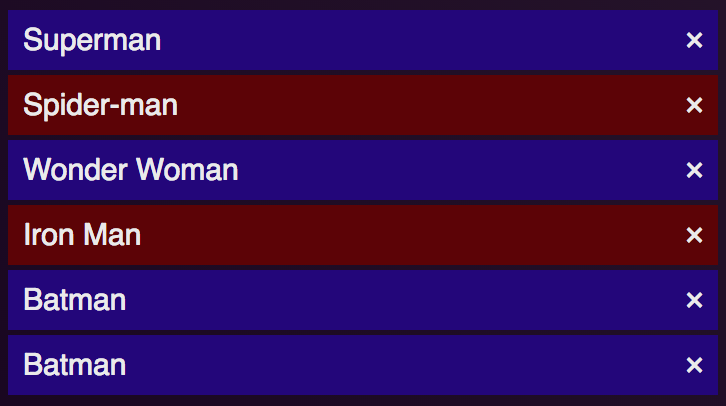
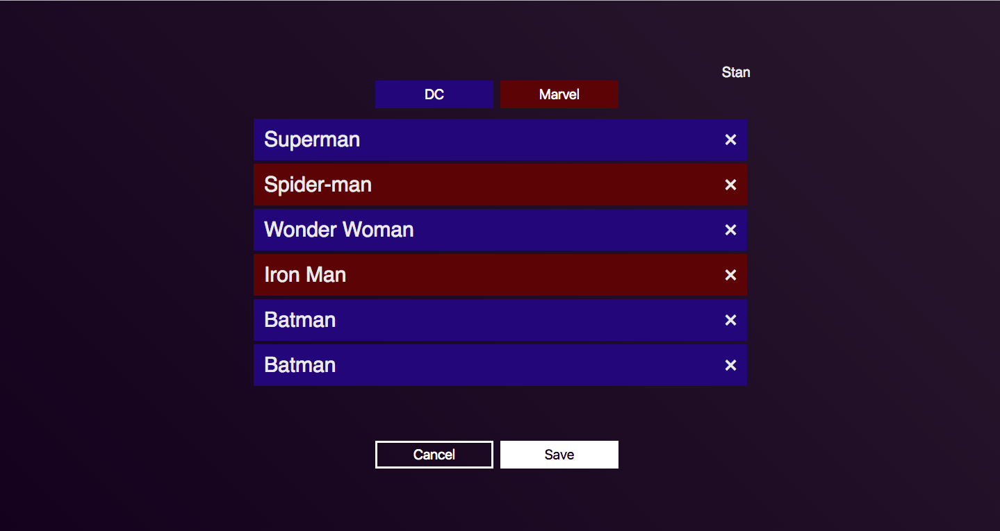

# Predata Code Challenge Instructions

Your task is to create a Mithril web app that allows a user to view and edit their list of superheroes. We have provided a skeleton to get you started.
We will assess the functionality, performance, structure, and styling of your solution. Please be prepared to discuss your solution during a brief review.
You should spend no more than four hours on this challenge.

You do not need to make changes to the Flask application or SQLite schemae, though it may be useful to inspect them.
The back-end does not implement any form of user authentication, and you don't need to add it. You can choose to be any user you'd like. We make the choice for you in the starter code, so you may not need to worry about this detail.


## Functionality
Please implement the following:

* Add Hero Buttons

   

   Each button will add a random hero from the corresponding `universe` (`DC` or `Marvel` as appropriate) to the end of the hero list associated with the user. The same hero may be added multiple times, but they should be different entries, as explained in the Hero List section.

* Hero List

   

   The list will display the heroes associated with the user. A hero may appear multiple times in the list, but each instance should be its own independent relation. For example, the two `Batman` rows in the example above are unique entries at the database layer.

   Each entry should feature the hero's name and a remove button. The remove button should remove that exact entry and not another entry showing the same hero.

* Cancel and Save Buttons

   

   The save button should save the user's current hero list state. Upon page refresh, the most recently saved state should load.

   The cancel button should undo any unsaved changes and revert the page to the most recently saved state.


## Visual Appearance
Once you have implemented the desired functionality, you may choose to style your application. Feel free to work based on the following mock:



If you think you can design something even better, go ahead!


## Setup
1. Create a Python 3 virtual environment with `python3 -m venv venv`
2. Activate the `venv` with `source venv/bin/activate`
3. Install dependencies with `pip install -r requirements.txt`


## Running the Server
1. `$ flask run` for production server or `$ FLASK_ENV=development flask run` for development server.  
   The development server starts a debugger and reloader. See <http://flask.pocoo.org/docs/1.0/server/> for more details.

2. Access <http://localhost:5000/>


## Endpoints
All endpoints return `JSON`.

### `/users/`
List all users

* Query string params: None
* Response: List of user objects
```
[
  {
    birthday: "YYYY-MM-DD",
    email: "e@mail.com",
    first_name: "First",
    last_name: "Last",
    pk: 1,
    relations: [
      {
        hero: 1,
        pk: 1,
        user: 1
      },
      ...
    ]
  },
  ...
]
```

### `/users/<int:pk>/`
Retrieve user with pk

* Query string params: None
* Response: User object
```
{
  birthday: "YYYY-MM-DD",
  email: "e@mail.com",
  first_name: "First",
  last_name: "Last",
  pk: 1,
  relations: [
    {
      hero: 1,
      pk: 1,
      user: 1
    },
    ...
  ]
}
```

### `/users/<int:pk>/edit/`
Edit user data. Currently only implements editing user hero relations.

* Query string params: None
* PATCH body format:
```
{
  add: List of hero pks, e.g. [1, 4, 5, ...]
  remove: List of relation pks, e.g. [1, 3, 7, ...]
}
```
Request content type should be `application/json`.
* Response: User object
```
{
  birthday: "YYYY-MM-DD",
  email: "e@mail.com",
  first_name: "First",
  last_name: "Last",
  pk: 1,
  relations: [
    {
      hero: 1,
      pk: 1,
      user: 1
    },
    ...
  ]
}
```

### `/heroes/`
List all heroes

* Query string params:
  * `universe`: String name (`DC`) or pk (`1`).
* Response: List of hero objects
```
[
  {
    alias: "Secret Identity",
    current_city: "City",
    debut_issue: "Comic Title (Vol. 1) #1",
    debut_year: "YYYY",
    hometown: "Town",
    name: "Hero Name",
    pk: 1,
    universe: {
      name: "DC",
      pk: 1
    }
  },
  ...
]
```

### `/heroes/<int:pk>/`
Retrieve hero with pk

* Query string params: None
* Response: Hero object
```
{
  alias: "Secret Identity",
  current_city: "City",
  debut_issue: "Comic Title (Vol. 1) #1",
  debut_year: "YYYY",
  hometown: "Town",
  name: "Hero Name",
  pk: 1,
  universe: {
    name: "DC",
    pk: 1
  }
}
```

### `/heroes/random/`
Retrieve random hero

* Query string params:
  * `universe`: String name (`DC`) or pk (`1`).
* Response: Hero object
```
{
  alias: "Secret Identity",
  current_city: "City",
  debut_issue: "Comic Title (Vol. 1) #1",
  debut_year: "YYYY",
  hometown: "Town",
  name: "Hero Name",
  pk: 1,
  universe: {
    name: "DC",
    pk: 1
  }
}
```
